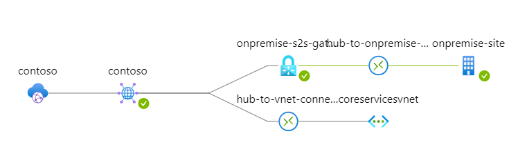
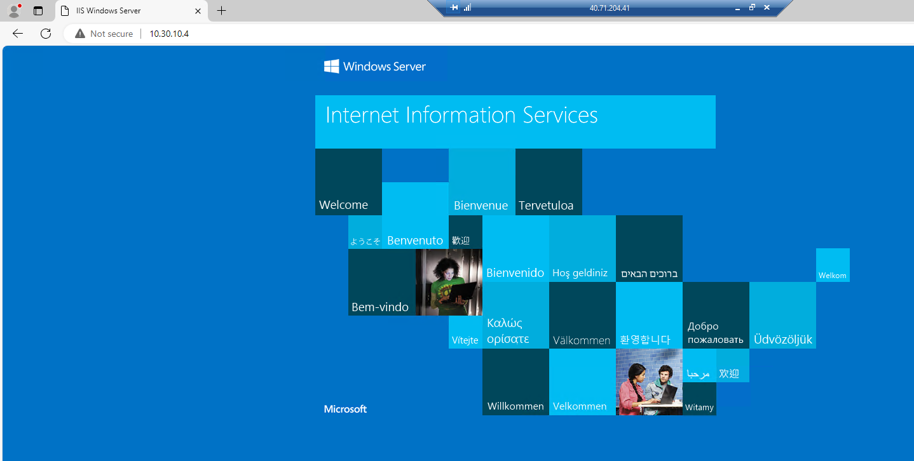

# Virtual WAN Demo

I have extended the exercise to create a full working Hub-and-Spoke pattern that connects an OnPremise network over VPN to an Azure VNET as depicted in the graphic below:

## Connecting the OnPremise network
I have chosen the manufacturing VNET to simulate my OnPremise network. Therefore the terraform project will provision a virtual network gateway with a VPN S2S configuration into the manufacturing vnet, as well as a local network gateway.

The local network gateway will be connected to the Hub VPN gateway using a PSK and it will forward all routes from the remote vnet (core services vnet) and the hub address space.

## Setting up the Hub
In the hub we have VPN S2S configuration to connect to the OnPremise network (manufacturing vnet) and a vnet connection to the core services vnet.

## Testing it
A virtual machine will be deployed to each vnet with RDP ports enabled. Connect to the OnPremise VM via RDP and enable a simple IIS webserver feature on it.

Connect then to the Core Services VM via RDP and open the webpage using the private IP address of the OnPremise VM:

